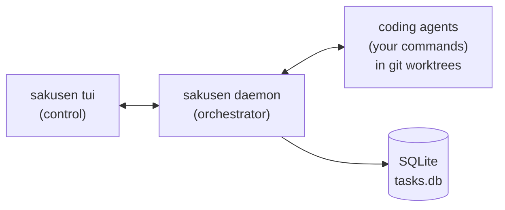

# 作戦

Sakusen is a daemon that orchestrates coding agents through long-lived, multi-step workflows. An agent is just a shell command you declare in config — [Claude Code](https://docs.anthropic.com/en/docs/claude-code), opencode, aider, a raw model CLI, anything — and Sakusen talks to it through a small environment-variable contract. Each task runs in its own git worktree on its own branch, advances through whatever steps you define in config — anything from a single "implement" step to a full plan/implement/review/approve/merge chain with loops and human gates — and reports back to a terminal UI where you stay in the driver's seat.

You decide what runs, how many run at once, where the human gates go, and how finished work lands on your base branch. Sakusen just keeps the agents on the rails.

> ⚠️ **Early days — breaking changes expected.** Sakusen is under active development. Config formats, CLI flags, and the database schema may change without notice between releases. Pin to a tagged version if you need stability.



## Why

- **You stay in control.** Human-approval gates pause any step until you sign off. Tmux steps drop you straight into the agent's session for back-and-forth.
- **Parallelism without conflicts.** Every task gets a dedicated git worktree and branch, so N agents can work concurrently on the same repo without stepping on each other.
- **Workflows, not one-shots.** Chain planning, implementation, review, and final-approval steps. Loop the review/implement cycle until it converges. Pass artifacts between steps.
- **It survives a reboot.** Tasks live in SQLite. Logs are persisted per step. Stop the daemon, restart it, pick up where you left off.
- **Local first.** No cloud, no telemetry. A Go binary, a Unix socket, a SQLite file under `~/.config/sakusen/`.

## Install

```bash
go install github.com/Bakaface/sakusen/cmd/sakusen@latest
```

Requires Go 1.25+. The binary lands in `$(go env GOBIN)` (defaults to `$(go env GOPATH)/bin`) — make sure that's on your `PATH`.

To pin to a specific release, replace `@latest` with a tag (e.g. `@v0.1.0`). To verify what you installed:

```bash
sakusen version
```

Building from a checkout works too:

```bash
git clone https://github.com/Bakaface/sakusen && cd sakusen
go build -o sakusen ./cmd/sakusen
```

## Quick Start

```bash
# Inside any git repo:
sakusen init               # writes .sakusen.yml + user-owned agent scripts under .sakusen/agents/
sakusen daemon start       # starts the background daemon (Unix socket)
sakusen tui                # opens the TUI
```

The scaffolded config defines two Claude Code agent records (`claude` headless, `claude-tmux` interactive) backed by editable scripts in `.sakusen/agents/` (they require `claude` and `jq` on `PATH`). Swap the commands to use any other tool — Sakusen itself has no agent hardcoded.

In the TUI, press `n` to create a new task, pick a workflow, and watch it run. Press `enter` on a task to follow its live logs.

To run from the command line instead:

```bash
sakusen create "Add a /healthz endpoint"          # creates a pending task
sakusen start <id>                                # kicks off its workflow
sakusen logs <id>                                 # tails its logs
sakusen tasks                                     # list, or `sakusen tasks <id>` for detail
```

## How a task runs

1. **You create a task** (TUI or `sakusen create`) and pick a workflow.
2. **The daemon picks it up** when a worker slot is free (`max_workers` controls concurrency).
3. **A worktree is provisioned** at `.worktrees/<branch>` on a new branch derived from `git.branch_template`. `worktree-sync-paths` and `worktree-setup-commands` run here (e.g. copy `.env`, run `bun install`).
4. **Each workflow step spawns an agent** in that worktree: Sakusen resolves the step's agent record (step → workflow → `default_agent` → `claude`), writes the rendered prompt to a file, and runs the agent's shell command with the `SAKUSEN_*` env contract exported (`SAKUSEN_PROMPT_FILE`, `SAKUSEN_RESULT_FILE`, ...). Stdout is streamed to the unified task log and broadcast to the TUI.
5. **Step context is captured** at the end of each step (the agent's result text from `$SAKUSEN_RESULT_FILE` by default, or a summary produced by your `summarizer:` command when `summarization_strategy: summarize_chat`) and made available to later steps via `{{steps.<name>.context}}`.
6. **Human gates pause** the workflow on `human: true` steps; **tmux-mode agents** suspend the workflow at an interactive session until a turn-end sentinel lands or you advance manually. **Loops** jump back to an earlier step until an exit condition is met or `max_iterations` is reached.
7. **On completion**, depending on `on_complete` (project-level, or the running workflow's override), Sakusen either leaves the work as a `commit` on the branch or `merge`s it into the base branch.

## Workflow configuration

Workflows live in `.sakusen.yml` at the repo root as a flat `workflows:` list. Each entry is either a string ref (resolved to `.sakusen/workflows/<name>.yml`) or an inline workflow mapping.

A workflow may **pin** any subset of New Task screen fields (`input`, `worktree`, `branch`, `checkout`, `target`). Pinned fields are pre-filled and hidden from the form. If all fields are pinned the New Task screen is skipped entirely and the task is created immediately. (A separate top-level `description:` is human-readable metadata — a one-line summary surfaced in the workflow picker and via MCP `list_workflows`; it is **not** a pin and never becomes the task input.)

Minimal `.sakusen.yml`:

```yaml
max_workers: 3

default_agent: claude
agents:
  claude:                         # any shell command; this one is Claude Code headless
    mode: headless
    command: 'claude --dangerously-skip-permissions -p "$(cat "$SAKUSEN_PROMPT_FILE")" | tee "$SAKUSEN_RESULT_FILE"'

git:
  base_branch: main
  branch_template: sakusen/{{task_id}}-{{task_slug}}

on_complete: merge                # commit | merge | none (per-workflow overridable)

workflows:
  - name: sensible workflow
    on_complete: commit           # optional: override the project-level on_complete
    steps:
      - name: implementing
        prompt: |
          Implement task #{{task.id}}: {{task.title}}
          {{task.input}}
        timeout: 30m

      - name: reviewing
        prompt: |
          Review the implementation.
          ## Implementation summary
          {{steps.implementing.context}}
        timeout: 20m
```

Workflows with no pins always prompt the New Task screen. Workflows that pin all fields (input + worktree + branch/checkout + target) skip the screen and create the task immediately — useful for predefined maintenance jobs or project bootstrapping pipelines:

```yaml
workflows:
  - name: housekeeping
    description: "Run standard maintenance: linting, dead code removal"   # metadata (picker/MCP)
    input: "Audit and clean the codebase: lint, remove dead code."        # pins the task input
    worktree: true
    branch: sakusen/housekeeping-{{task.id}}
    target: main
    steps:
      - name: cleaning
        prompt: "Audit and clean the codebase."
```

File pool is flat: `.sakusen/workflows/<name>.yml` (no `tasks/`, `one-off/`, or `init/` subdirectories). Global pool: `~/.sakusen/workflows/<name>.yml`.

### Step options

| Key | Type | Notes |
|---|---|---|
| `name` | string | Step ID, used in `{{steps.<name>.context}}` and loop targets. |
| `prompt` | string | Templated prompt sent to the agent. |
| `agent` | string | Agent slug for this step. Step-level overrides workflow-level `agent:`, which overrides `default_agent:`. The agent's `mode` (headless/tmux) decides how the step executes. |
| `timeout` | duration | e.g. `30m`. Default: 30 minutes. |
| `human` | bool | Pause and wait for explicit approval in the TUI. |
| `summarization_strategy` | enum | `last_message`, `summarize_chat` (default; runs your `summarizer:` command over the chat log), or `none` (no context captured). |
| `loop` | object | Jump back to an earlier step. See below. |

### Loops

```yaml
- name: reviewing
  prompt: |
    Review iteration {{loop.iteration}} of {{loop.max_iterations}}.
    {{steps.implementing.context}}
    If everything passes, output nothing.
  loop:
    goto: implementing
    max_iterations: 3
    exit_condition:
      step_context_empty: reviewing   # exit early when this step's output is empty
```

Loops must point to an earlier step, can't be `human:` or resolve to a tmux-mode agent, and can't overlap with other loops.

### Template variables

Available in any step `prompt`:

- `{{task.id}}`, `{{task.title}}`, `{{task.input}}`, `{{task.context}}`, `{{task.slug}}`, `{{task.branch}}`
  — `task.input` is the user-supplied task input; `task.context` is the summary written by the workflow's summarizer after the task completes; empty until then.
- `{{tasks.<id>.<field>}}` — reference another task's field by ID. Supported fields: `title`, `branch`, `input`, `context`.
  References inside the task's own `input`/`context` are pre-expanded before being inlined into a step prompt
  (single-pass; nested refs in the looked-up task's fields remain verbatim).
  At create or edit time, references are validated:
  - missing task, cross-project, failed dependency, or unsupported field → request is rejected;
  - active dependency → added automatically to `blocked_by`;
  - completed dependency → no edge added (its fields are already resolvable);
  - self-reference → resolved at runtime, but never added as a `blocked_by` edge.
  `{{tasks.<id>.context}}` is only populated after the referenced task has been summarized.
- `{{git.base_branch}}`
- `{{steps.<step_name>.context}}` — captured output of a prior step
- `{{loop.iteration}}`, `{{loop.max_iterations}}` (inside a loop body)

### Worktree provisioning

```yaml
worktree-sync-paths:
  copy: [".env", ".env.local"]      # copied into each worktree
  link: [".claude", "node_modules"] # symlinked

worktree-setup-commands:            # run sequentially after sync
  - bun install
  - bun run db:migrate

tmux-setup-command: |               # run once after tmux session creation
  tmux split-window -h "tail -f .sakusen/logs/<id>/<step>.log"
```

## Project layout reset


```
cmd/sakusen/         CLI entry points (daemon, tui, task CRUD)
internal/
  config/           .sakusen.yml parsing, agent registry, project type auto-detection
  daemon/           Background daemon: Unix socket server, scheduling, pub/sub
  workflow/         Step engine, prompt templating, summarizer, merge logic
  runner/           Agent command spawning (headless Process, RunSync, tmux wrapper scripts)
  agent/            Agent state machine, concurrent worker manager
  task/             Task model, status state machine, priority, dependencies
  tui/              BubbleTea terminal UI (list, detail, prompt, animation)
  db/               SQLite persistence and migrations
  git/              Worktree, branch, merge, conflict-resolution operations
  tmux/             Tmux session lifecycle, capture, monitoring
  client/           IPC client (RPC + event subscription) for tui/cli
  notify/           Desktop notifications
claude-code-plugin/ Companion Claude Code plugin (sakusen-configurer skill)
```

The daemon listens on a Unix socket at `~/.config/sakusen/daemon.sock` (or `$XDG_CONFIG_HOME/sakusen/`) and persists state to `tasks.db` next to it. Project-level data (logs, the `.worktrees/` directory) lives under `.sakusen/` inside the repo.

## TUI

Launch with `sakusen tui`. Add `-g` / `--global` to see tasks across every project Sakusen has tracked.

Common keys (full help with `ctrl+h`):

| Key | Action |
|---|---|
| `j` / `k` / `↑↓` | Move selection |
| `enter` | Open task detail / follow live logs |
| `n` / `N` | New task / new blocking task |
| `c` | Continue an awaiting-approval / completed / failed task |
| `s` | Stop the running step |
| `r` / `R` | Retry / revert |
| `t` | Attach to the task's tmux session |
| `b` / `alt+b` | Branch a new task off this one / toggle branch tree view |
| `D` / `A` | Detach branch from worktree / reattach |
| `o` / `e` | Open / edit step context (artifact) |
| `dd` | Delete task (worktree + branch + logs) |
| `/`, `?`, `n`, `N` | Vim-style search and next/prev match |
| `gg`, `G`, `:N` | Jump to top, bottom, or line N |

In the detail view, `j/k/G/gg/ctrl+u/ctrl+d` scroll logs; `esc` toggles between follow and normal mode; `e` opens the log file in `$EDITOR`.

## Agents

Every workflow step runs an **agent**: a shell command declared under the top-level `agents:` map. Steps pick one via `agent: <slug>` (step-level beats workflow-level beats `default_agent:`, which falls back to the `claude` slug). The agent record's `mode` decides how the step executes:

- **`headless`** (default) — Sakusen spawns the command, streams its stdout to the task log, and reads the final result text from `$SAKUSEN_RESULT_FILE` when it exits.
- **`tmux`** — Sakusen runs the command inside a detached tmux session (`<project>-<task_id>`); the workflow pauses at the interactive session.

```yaml
default_agent: claude

agents:
  claude:
    mode: headless
    command: '"$SAKUSEN_PROJECT_PATH/.sakusen/agents/claude-headless.sh"'
  claude-tmux:
    mode: tmux
    command: '"$SAKUSEN_PROJECT_PATH/.sakusen/agents/claude-tmux.sh"'
    resume_command: 'claude --dangerously-skip-permissions --resume "$SAKUSEN_SESSION_ID"'
    chat_log_command: '"$SAKUSEN_PROJECT_PATH/.sakusen/agents/claude-chat-log.sh"'

summarizer:                 # utility LLM: chat/step/task summaries + AI task titles
  command: claude -p --output-format text --model haiku --dangerously-skip-permissions
  max_prompt_bytes: 380000
```

Sakusen communicates with agents purely through environment variables: `SAKUSEN_PROMPT_FILE` (the fully-resolved step prompt), `SAKUSEN_RESULT_FILE` (headless result text), `SAKUSEN_DONE_DIR`/`SAKUSEN_DONE_PREFIX` (tmux turn-end sentinels), plus `SAKUSEN_TASK_ID`, `SAKUSEN_STEP`, `SAKUSEN_WORKTREE`, `SAKUSEN_PROJECT_PATH`, `SAKUSEN_AGENT`, and `SAKUSEN_PURPOSE`.

**Tmux auto-advance is sentinel-driven**: when the agent finishes a turn, something inside the session (a hook, the agent itself, an idle-watcher) writes `"$SAKUSEN_DONE_DIR/$SAKUSEN_DONE_PREFIX-$(date +%s%N).json"`; the daemon polls for these files and advances the workflow (unless the step has `human: true`). The file may carry a JSON payload with `session_id` (enables `resume_command` restore and `chat_log_command` lookup) and `transcript_path`. The scaffolded `claude-tmux` agent wires this up via a Claude Code `Stop` hook; agents that never write a sentinel are **manual-advance** — the task waits in `tmux` status until you advance it. Agents without a `chat_log_command` can't capture `summarize_chat` context for tmux steps. Without a `summarizer:` there are no AI titles or summaries (titles fall back to truncated input).

| agent `mode` | `human` | Behavior |
|---|---|---|
| headless (default) | false | headless spawn + auto-advance on exit |
| headless | true | headless spawn, then pause at `awaiting_approval` |
| tmux | false | tmux + auto-advance on turn-end sentinel (manual-advance if the agent writes none) |
| tmux | true | tmux + manual approval (drop into the session, then press `a`/`c`) |

Press `t` in the TUI to attach to a tmux session. Sakusen detects nested-tmux situations (you're already inside tmux) and either switches client or nests a session, controlled by `tmux_nested_attach_behavior` (`switch` / `nest`).

`sakusen attach <task_id>` does the same from the shell.

### Migrating from `claude:` / `yolo:` / `print:` configs

The old Claude-specific keys were removed and are now hard load errors with migration messages:

- `claude:` (binary override) → define agents under `agents:` (run `sakusen init` in a fresh project for scaffolded records)
- `yolo:` → put permission flags (e.g. `--dangerously-skip-permissions`) directly in the agent's `command`
- `system_prompt:` → bake system-prompt flags into the agent's `command` or fold the text into step prompts
- `allowed_summarization_models:` → the `summarizer:` command; pick the model inside it
- `print:` / `tmux:` (workflow and step level) → select an agent whose `mode` is `headless` (was `print: true`) or `tmux` (was `print: false`)
- `{{claude_command}}` in `tmux-setup-command` → `{{agent_command}}` or `{{run_agent}}`

## CLI reference

**Daemon**

```bash
sakusen daemon start           # start (foreground; background it with '&' or your service manager)
sakusen daemon stop            # graceful shutdown
sakusen daemon status          # is it running, what PID
```

**Tasks**

```bash
sakusen create <input> [--workflow w] [--priority high] [--title T]
              [--branch tmpl] [--target main] [--checkout existing-branch]
              [--no-worktree]
sakusen tasks [<id>] [--json]  # list, or detail for one
sakusen edit <id> [--title T] [--input I] [--context C] [--priority P]
sakusen delete <id> [-y]
sakusen start <id>             # manually kick off a pending task
sakusen stop <id>              # stop a running task
sakusen retry <id> [--from-step name]  # restart workflow (default) or jump to a specific step
sakusen revert <id>            # revert all commits made by a completed task
sakusen continue <id>          # resume an awaiting-approval / completed / failed task
sakusen logs <id> [step] [-n N]
sakusen cleanup [<id>]         # remove worktree + branch + logs for completed/failed
sakusen agents [--json]        # list running agents
sakusen depends-on add <id> <blocked-by-id>     # mark <id> as blocked by another task
sakusen depends-on rm  <id> <blocked-by-id>     # remove a dependency
sakusen depends-on list <id>                    # list tasks blocking <id>
```

**Worktree branch management**

```bash
sakusen detach <id>            # detach branch so you can check it out elsewhere
sakusen attach-branch <id>     # reattach after detach
sakusen attach <id>            # attach to the task's tmux session
```

**TUI**

```bash
sakusen tui [-g]               # -g for cross-project view
```

## Requirements

- Go 1.25+
- git (worktree support, ≥ 2.5)
- Whatever your configured agent commands need — the `sakusen init` scaffold uses the [Claude Code](https://docs.anthropic.com/en/docs/claude-code) CLI (`claude`) and `jq`
- tmux (only required if you use tmux-mode agents or `sakusen attach`)
